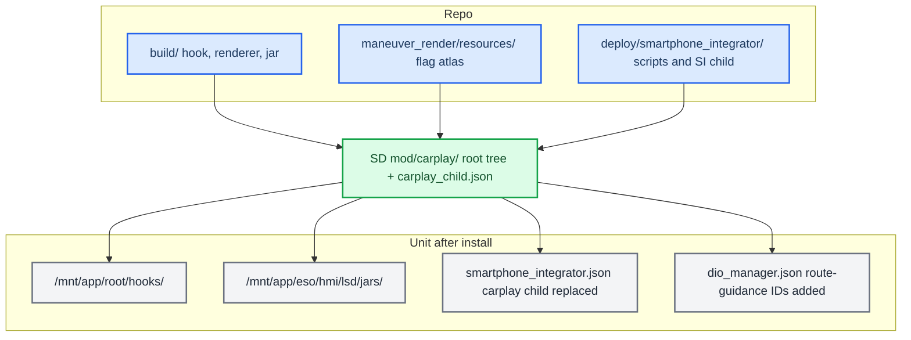
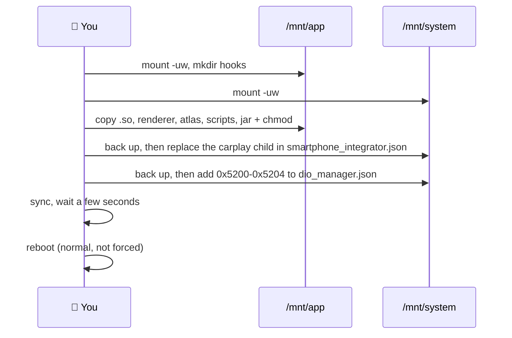

# Install, verify and uninstall

*The build scripts only produce loose binaries. A release is staged by hand and installed either with
the M.I.B. custom script (recommended) or by hand in a root shell on the unit. Both do exactly the same thing: copy eight
files, replace one SI child and register five iAP2 message IDs. Nothing is started, stopped or
rebooted for you.*

> [!IMPORTANT]
> Back up anything you change by hand. The M.I.B. script keeps a `.carplay-stock` copy of every
> config it edits, but a manual install is only as reversible as your own backups.

---

## 📦 What a release contains

This branch replaces **no stock binary** and edits **no firewall profile**: the cluster keeps the
head unit's own map, so there is no CarPlay video stream and no extra RTSP port to open. A release is
eight files plus two in-place config edits.

| File | Source in the repo | On-unit path | Mode |
|---|---|---|---|
| `libcarplay_hook.so` | `build/` (`build_hook.sh`) | `/mnt/app/root/hooks/` | 755 |
| `maneuver_render` | `build/` (`build_renderers.sh`) | `/mnt/app/root/hooks/` | 755 |
| `flag_atlas.rgba` | `maneuver_render/resources/` | `/mnt/app/root/hooks/` (read from there, `maneuver_render/main.c:45`) | 644 |
| `carplay_startup.sh`, `carplay_monitor.sh`, `carplay_processes.sh`, `carplay_cleanup.sh` | `deploy/smartphone_integrator/` | `/mnt/app/root/hooks/` | 755 |
| `carplay_hook.jar` | `build/` (`build_java.sh`) | `/mnt/app/eso/hmi/lsd/jars/` | 644 |
| `carplay_child.json` | `deploy/smartphone_integrator/` | not a file on the unit: spliced into `smartphone_integrator.json` as `children.carplay` | - |
| `dio_manager.json` | not staged | `/mnt/system/etc/eso/production/`, five route-guidance IDs added in place | - |

Build the three compiled outputs first (`build_hook.sh`, `build_renderers.sh`, `build_java.sh`); see
[README - Build](../../README.md#-build). Everything else is copied unchanged.



**Compatibility.** The patch is not limited to US, EU or CN units, nor to one MU train: it is
meant for any MHI2Q MU firmware (developed on MU1316). What matters is:

- a fully digital instrument cluster (Audi virtual cockpit); cars with an analog cluster are not
  supported;
- preferably, the latest firmware available for the unit, flashed before installing the patch.

With both in place it should almost certainly work, as long as nothing went wrong during the
install itself.

## 💾 Install with M.I.B. (recommended)

**1. Stage the card.** Copy the contents of `install_MoreIncredibleBash/` to the root of the M.I.B.
SD card, then put the release into `mod/carplay/`. The simplest way: download **all** assets of a
GitHub release and drop them straight into `mod/carplay/` - no folders:

```text
SD1/
  mod/custom.sh
  mod/command.sh
  mod/carplay/carplay_child.json
  mod/carplay/libcarplay_hook.so
  mod/carplay/maneuver_render
  mod/carplay/flag_atlas.rgba
  mod/carplay/carplay_startup.sh
  mod/carplay/carplay_monitor.sh
  mod/carplay/carplay_processes.sh
  mod/carplay/carplay_cleanup.sh
  mod/carplay/carplay_hook.jar
```

`custom.sh` knows where each of these names goes (`/mnt/app/root/hooks/`, the jar to
`/mnt/app/eso/hmi/lsd/jars/`) and ignores any other file in the folder. A self-built release from
the repo can use the same flat layout (`build/` outputs, `maneuver_render/resources/flag_atlas.rgba`,
the five files from `deploy/smartphone_integrator/`), or a tree with each file at its on-unit path
under `root/`:

```text
SD1/
  mod/custom.sh
  mod/command.sh
  mod/carplay/carplay_child.json                   from deploy/smartphone_integrator/
  mod/carplay/root/mnt/app/root/hooks/libcarplay_hook.so
  mod/carplay/root/mnt/app/root/hooks/maneuver_render
  mod/carplay/root/mnt/app/root/hooks/flag_atlas.rgba
  mod/carplay/root/mnt/app/root/hooks/carplay_startup.sh
  mod/carplay/root/mnt/app/root/hooks/carplay_monitor.sh
  mod/carplay/root/mnt/app/root/hooks/carplay_processes.sh
  mod/carplay/root/mnt/app/root/hooks/carplay_cleanup.sh
  mod/carplay/root/mnt/app/eso/hmi/lsd/jars/carplay_hook.jar
```

`.gitignore` keeps the staged payload out of git, so the card can be staged in place inside the repo.
Both layouts can be mixed; the flat files are installed first.

**Checks before anything is copied** (`list_payload` in `custom.sh`). The flat release is all or
nothing: `custom.sh` knows the eight names and checks each one on the card by name, so a partly
copied release stops with `FAILED release incomplete, missing in …: <names>` (a new
`carplay_startup.sh` must never run without `carplay_monitor.sh`). The card is never walked for the
flat files. The `root/` tree does need `find`, and QNX fs-dos makes it fail with
`./dir/..: Filename too long` on some FAT cards although its list is complete, so exactly that error
is tolerated and any other `find` error fails the install.

**2. Run it.** Disconnect CarPlay, then **GEM -> M.I.B. -> Advanced Settings** and pick the script
entry your M.I.B. shows:

| M.I.B. | Entry | Runs |
|---|---|---|
| `main` since `e531867` (2024-07-05) | **Run Custom Script** | `/mod/custom.sh` |
| release zips up to V3.7.1 | **Run individual script** | `/mod/command.sh`, which forwards to `custom.sh` |

The card is FAT and cannot hold a symlink, so `command.sh` is a two-line forwarder; when the M.I.B.
launcher sources it while installing M.I.B. itself, it does nothing. With `custom.sh` alone a release
M.I.B. prints "Nothing to do!". If the script is started on the RCC it hands itself to the MMX.
`custom.sh`:

1. remounts `/mnt/app` and `/mnt/system` read-write;
2. copies each flat release file to its fixed path and every file under `root/` to the same path
   under `/`, each through `<file>.carplay-new.<pid>`
   and an atomic `mv`, and sets its mode (755 for `.so`, `maneuver_render`, `*.sh`; 644 otherwise);
3. deletes M.I.B.'s `NavActiveIgnore.jar` / `navignore_*.jar` if present (see [Traps](#-traps));
4. replaces the `"carplay"` child of `smartphone_integrator.json` with `carplay_child.json`, keeping
   the trailing comma, and refuses to write if the child count would change;
5. registers the route-guidance IDs in `dio_manager.json` (see
   [Route-guidance message IDs](#-route-guidance-message-ids));
6. runs `sync` and prints `DONE (install). Reboot the HU to load.`

It stops no processes and does not reboot. Re-running it is safe: the stock backups are taken once
and never overwritten by a patched file.

**3. Read the output.** Look for `SI json patched` and `dio_manager.json route-guidance IDs registered`
(or `already registered`). A `WARN` line means that file had an unexpected layout and was left as-is:

| Output | Meaning | What to do |
|---|---|---|
| `no payload in …/carplay (release files or root/ tree)` | neither release files nor `root/` found | stage the card again |
| `FAILED release incomplete, missing in …: <names>` | only part of the release reached `mod/carplay/` | copy all release assets again |
| `FAILED listing payload` | `find` over `root/` failed with an unexpected error | check the card, or use the flat release layout |
| `WARN no carplay_child.json resource` | JSON patch skipped, the hook will never load | put `carplay_child.json` in `mod/carplay/` and re-run |
| `WARN unsupported carplay layout` / `expected one carplay child` | SI json not in the stock shape | edit it by hand ([manual step 3](#3-edit-two-config-files)) |
| `WARN dio_manager.json: …; left as-is` | the ID lists were not found exactly once | add the IDs by hand before rebooting |

**4. Flush and reboot** - see [Reboot and verify](#-reboot-and-verify).

## 🔧 Manual install (without M.I.B.)

The same install by hand. You need a **root shell on the unit, over SSH or Telnet**, whichever your
unit has enabled. How you get one and the address to connect to depend on your unit; this guide does
not assume either. Disconnect CarPlay first. Put the release files somewhere on the unit (an SD card
or USB stick works) and `cd` there.



### 1. Make the partitions writable

```bash
mount -uw /mnt/app
mount -uw /mnt/system
mkdir -p /mnt/app/root/hooks
```

### 2. Copy the files

```bash
cp libcarplay_hook.so maneuver_render flag_atlas.rgba /mnt/app/root/hooks/
cp carplay_startup.sh carplay_monitor.sh carplay_processes.sh carplay_cleanup.sh /mnt/app/root/hooks/
chmod 755 /mnt/app/root/hooks/libcarplay_hook.so /mnt/app/root/hooks/maneuver_render /mnt/app/root/hooks/carplay_*.sh
chmod 644 /mnt/app/root/hooks/flag_atlas.rgba
cp carplay_hook.jar /mnt/app/eso/hmi/lsd/jars/
chmod 644 /mnt/app/eso/hmi/lsd/jars/carplay_hook.jar
```

To replace a file that is already running (an update over a previous install), copy it to
`<name>.new` in the same folder and `mv` it onto the real name: a `mv` inside one partition is a
rename, so the running process keeps the copy it already opened and nothing ever sees a half-written
file. Do **not** overwrite the stock `/etc/scripts/carplay_cleanup.sh`: ours lives in
`/mnt/app/root/hooks/` and calls the stock one for Audi's mdnsd/PPS teardown.

### 3. Edit two config files

Edit each on the unit, or copy it off, edit it and copy it back. Keep a stock copy first:

```bash
F=/mnt/system/etc/eso/production
cp -p $F/smartphone_integrator.json $F/smartphone_integrator.json.carplay-stock
cp -p $F/dio_manager.json $F/dio_manager.json.carplay-stock
```

The `.carplay-stock` names are the ones the M.I.B. uninstaller restores, so a manual install can
still be removed with it.

**`smartphone_integrator.json`**: replace the whole `"carplay": { … }` block under `children` with the
contents of `deploy/smartphone_integrator/carplay_child.json`, and keep the comma after it. The stock
block runs `dio_manager` directly; ours runs `carplay_startup.sh`, which scopes `LD_PRELOAD` to its own
`dio_manager` (there is **no** `LD_PRELOAD` in `envs`):

```json
"carplay": {
  "exec": "carplay_startup.sh",
  "path": "/mnt/app/root/hooks",
  "params": "",
  "envs": [
    "LD_LIBRARY_PATH=/mnt/app/root/lib-target:/eso/lib:/mnt/app/usr/lib:/mnt/app/armle/lib:/mnt/app/armle/lib/dll:/mnt/app/armle/usr/lib",
    "IPL_CONFIG_DIR_DIO_MANAGER=/etc/eso/production"
  ],
  "startupTimeout": 10000,
  "stopTimeout": 8000,
  "watchdogTimeout": 60000,
  "disableWatchdog": false,
  "maxSetupRetries": 2,
  "maxRuntimeRetries": 2,
  "decoderUse": false,
  "selfTermination": true,
  "cleanupScript": "/mnt/app/root/hooks/carplay_cleanup.sh",
  "retriesBeforeDowntime": 3,
  "downtime": 30000,
  "restartDelay": 3000,
  "portResetTime": 250
},
```

**`dio_manager.json`**: append the five route-guidance IDs at the end of the two lists. The stock lists
are the same on every unit, so the two lines change like this:

```json
before:
"MessagesSentByAccessory":["0x5000", "0x5002", "0xAE00", "0xAE02", "0xAE03", "0x4154", "0x4156", "0x4157", "0x4159", "0xFFFB", "0x4C00", "0x4C02", "0x4C03", "0x4C05"],
"MessagesReceivedFromDevice":["0x4E09", "0x4E0A", "0x4E0C", "0x5001", "0xAE01", "0x4155", "0x4158", "0xFFFA", "0xFFFC", "0x4C01", "0x4C04"],

after:
"MessagesSentByAccessory":["0x5000", "0x5002", "0xAE00", "0xAE02", "0xAE03", "0x4154", "0x4156", "0x4157", "0x4159", "0xFFFB", "0x4C00", "0x4C02", "0x4C03", "0x4C05", "0x5200", "0x5203"],
"MessagesReceivedFromDevice":["0x4E09", "0x4E0A", "0x4E0C", "0x5001", "0xAE01", "0x4155", "0x4158", "0xFFFA", "0xFFFC", "0x4C01", "0x4C04", "0x5201", "0x5202", "0x5204"],
```

The file carries `##` comment lines, so edit it as text and never run it through a JSON tool.

### 4. Flush and reboot

```bash
sync
```

Then continue with [Reboot and verify](#-reboot-and-verify).

## 🧭 Route-guidance message IDs

Route guidance needs **two** things; the install provides the second:

1. **The hook's Identify patch** (automatic, at runtime). It adds the route-guidance component
   `0x001E` to the outgoing iAP2 Identify so iOS offers route guidance at all (see
   [iap2-interception](../hook/iap2-interception.md)). It does not touch any message-ID list.
2. **The message-ID registration** in `dio_manager.json`. The Cinemo iAP2 SDK inside `dio_manager`
   only passes listed messages; without the IDs iOS sends route guidance and the SDK drops it before
   the hook sees it, and iOS never sends lane guidance (`0x5204`) unless it is in the received list.

| List | IDs to add | Messages |
|---|---|---|
| `MessagesSentByAccessory` | `0x5200`, `0x5203` | StartRouteGuidanceUpdates, StopRouteGuidanceUpdates |
| `MessagesReceivedFromDevice` | `0x5201`, `0x5202`, `0x5204` | RouteGuidanceUpdate, RouteGuidanceManeuverUpdate, LaneGuidanceInformation |

**In the installer**, `patch_dio()` does this in plain ksh: it reads the file line by line, appends each
missing ID before the list's closing `]`, leaves `##` lines alone, refuses to write unless it found
exactly one of each list and all five IDs are present afterwards, backs up the stock file once as
`dio_manager.json.carplay-stock` and swaps the result in with an atomic rename. Re-running it is a
no-op. `scripts/test_install_dio.sh` (part of `scripts/run_tests.sh`) checks all of that under ksh,
dash and sh.

<details>
<summary>From the host over SSH, when the unit only needs this one step</summary>

Run in a `#!/bin/bash` script (zsh does not word-split), with `HU` set to the unit's SSH target:

```bash
F=/mnt/system/etc/eso/production/dio_manager.json

# 1. Make /mnt/system writable and keep a stock backup once.
ssh -n "$HU" "mount -uw /mnt/system; [ -e $F.carplay-stock ] || cp -p $F $F.carplay-stock"

# 2. Pull the file and add the five IDs on the host. Re-running is a no-op.
ssh -n "$HU" "cat $F" > dio_manager.json
python3 - dio_manager.json <<'PY'
import re, sys
path = sys.argv[1]
text = open(path).read()
add = {"MessagesSentByAccessory": ["0x5200", "0x5203"],
       "MessagesReceivedFromDevice": ["0x5201", "0x5202", "0x5204"]}
for key, ids in add.items():
    m = re.search(r'"%s"\s*:\s*\[([^\]]*)\]' % key, text)
    have = [h.upper() for h in re.findall(r'"(0x[0-9A-Fa-f]+)"', m.group(1))]
    new = [i for i in ids if i.upper() not in have]
    if new:
        text = text[:m.end(1)] + "".join(', "%s"' % i for i in new) + text[m.end(1):]
open(path, "w").write(text)
PY

# 3. Push it back atomically (the unit has no scp), then flush to flash.
ssh "$HU" "cat > $F.new" < dio_manager.json
ssh -n "$HU" "chmod 644 $F.new && mv $F.new $F && sync"

# 4. Verify: all five IDs must be printed.
ssh -n "$HU" "grep -o '\"0x520[0-4]\"' $F"
```

To undo only this step: `ssh -n "$HU" "mount -uw /mnt/system; mv $F.carplay-stock $F; sync"`, then
reboot.

</details>

---

## ✅ Reboot and verify

After `sync`, **wait a few seconds**, then reboot normally. A forced reboot (the MMI button combo)
right after copying can leave files truncated or missing, and nothing loads. The install only becomes
active after the reboot: the jar is on j9's boot classpath, and `dio_manager` reads its config only at
start.

On the unit, the three edits must be visible:

```bash
grep carplay_startup.sh /mnt/system/etc/eso/production/smartphone_integrator.json
grep -o '"0x520[0-4]"' /mnt/system/etc/eso/production/dio_manager.json   # all five IDs
ls -l /mnt/app/root/hooks/ /mnt/app/eso/hmi/lsd/jars/carplay_hook.jar
```

Then connect the phone and start a route in Apple Maps: the maneuver panel must appear on the cluster
over the stock map, with the turn arrow on the HUD. Logs: `/tmp/carplay_hook.log`,
`/tmp/carplay_java.log`, `/tmp/maneuver_render.log`, `/tmp/carplay_wrapper.log` (see
[README - Logging](../../README.md#-logging)). If route guidance never appears, check the
`dio_manager.json` grep first: with the IDs missing the SDK drops the messages before the hook, so the
hook logs nothing about them.

## 🗑️ Uninstall

**With M.I.B.:** copy `uninstall_MoreIncredibleBash/` over the card and run the custom script. It
needs no payload tree: it renames every `*.carplay-stock` under `/mnt/app` and `/mnt/system` back to
the original (the SI json and `dio_manager.json`), then deletes the eight owned files and the
renderer's shader cache `/mnt/persist/var/app/luka_carplay_maneuver`. `custom.sh
uninstall` from the install card is a second path while the payload tree is still on it.

**By hand:**

```bash
mount -uw /mnt/app; mount -uw /mnt/system
F=/mnt/system/etc/eso/production
mv $F/smartphone_integrator.json.carplay-stock $F/smartphone_integrator.json
mv $F/dio_manager.json.carplay-stock $F/dio_manager.json
cd /mnt/app/root/hooks && rm -f libcarplay_hook.so maneuver_render flag_atlas.rgba carplay_startup.sh carplay_monitor.sh carplay_processes.sh carplay_cleanup.sh
rm -f /mnt/app/eso/hmi/lsd/jars/carplay_hook.jar
rm -rf /mnt/persist/var/app/luka_carplay_maneuver
sync
```

Then reboot the same careful way.

## 📋 Collect logs

Copy `logging_MoreIncredibleBash/` over the card and run it the same way as the installer. Each run
makes `<card>/carplay_logs/NNN/` (numbered: the unit clock is often wrong; `info.txt` records the clock
and whether verbose was on). It holds the `/tmp` logs (`*.log*`, `carplay_*`, `*.pid`, never the
shared-memory objects that also live in `/tmp`), `sloginfo` of MMX and RCC, `pidin`, mounts, network,
the hook and jar listing, the two configs we patch and cores of `dio_manager`, `maneuver_render` and
`smartphone_integrator`. A read-only card is remounted writable. The run ends by creating
`/tmp/carplay_verbose`, so: run once, reconnect the phone and use CarPlay, run again to save the
verbose session. The marker is in RAM and goes away on reboot; hook and Java log read it at every
CarPlay session start. Nothing is deleted on the unit. Checked by `scripts/test_logging_mib.sh`.

## ⚠️ Traps

**Never restart the Java stack on a live unit.** `carplay_hook.jar` sits on j9's `-Xbootclasspath`, so
it does nothing until the JVM restarts, and killing j9 counts as a critical-process death that
restarts the whole system (about 50 s, screen black). A redeployed `libcarplay_hook.so` is picked up by
the next `dio_manager` generation; the jar only by a reboot.

**A card written from a Mac carries `._name` and `.DS_Store` files.** `custom.sh` skips them, so an
AppleDouble `._carplay_hook.jar` never lands on j9's boot classpath.

**M.I.B.'s NavActiveIgnore jar must not sit next to ours.** "NavActiveIgnore on" copies
`navignore_audi.jar` / `navignore_vw.jar` to `lsd/jars/NavActiveIgnore.jar`. It replaces
`org.dsi.ifc.carplay.AppState` so `getAppStateID()` and `getOwner()` always return 0, and the CarPlay
lifecycle loses which resources CarPlay owns. `custom.sh` deletes it (and hand-copied `navignore_*.jar`)
without a backup; after a manual install, delete it yourself.

**The unit's shell is bare QNX 6.5.** Pushing files over SSH (the host-side snippets above) fails in
predictable ways:

| Trap | Fix |
|---|---|
| no `scp` binary on the unit | `ssh host 'cat > /path/file.new' < local`, then `chmod`, `mv`, `sync` |
| sshd rate-limits repeated password logins | one multiplexed master (`ControlMaster=auto`, short `ControlPath`) reused by every call |
| `ssh` inside `while read` eats the loop's stdin | always `ssh -n` (or `< /dev/null`) in loops |
| zsh does not word-split unquoted `$OPTS` | put deploy snippets in a `#!/bin/bash` script |
| login banner prints on STDOUT even for `ssh host cmd` | for binary read-back print a marker first (`echo __BEGIN__; cat f`) and strip up to it |
| no `sha256sum`, `cksum`, `tar`, `base64` | the only end-to-end check is reading the file back and `cmp` locally |

`/mnt/app` and `/mnt/system` stay read-only until `mount -uw`. `/tmp` is `/dev/shmem` and cannot hold
directories.

Runtime ownership after the reboot (who starts `maneuver_render`, why it outlives `dio_manager`) is in
[supervisor-lifecycle](supervisor-lifecycle.md).
