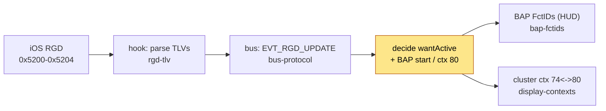
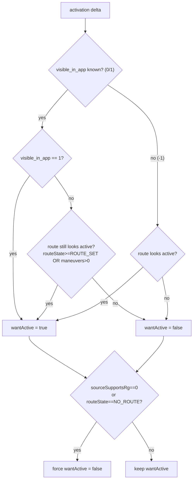
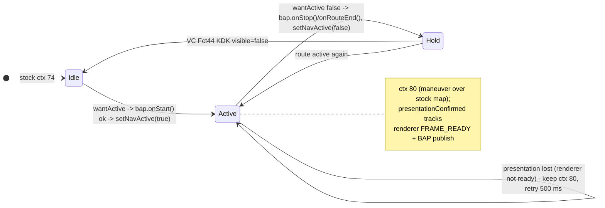

# RGD activation & the `visible_in_app` authority

How the patch decides that CarPlay route guidance is **active** (cluster shows the maneuver overlay)
versus **inactive** (return to the stock cluster).

## 📋 Context

Where this sits in the route-guidance path - **you are here** decides *active/inactive*; everything
upstream just delivers state, everything downstream renders it:

> [rgd-tlv](rgd-tlv.md) - parse TLVs -> [bus-protocol](../hook/bus-protocol.md) - EVT_RGD_UPDATE -> **rgd-activation** - decide active ->
> [bap-fctids](bap-fctids.md) - HUD + [compositing](../cluster/compositing.md) - cluster overlay

## 🔍 The decision

`RouteGuidance` recomputes `wantActive` on every activation-relevant delta from three iAP2 inputs:

| Input | iAP2 source | Meaning |
|---|---|---|
| `routeState` | RouteGuidanceState (TLV 0x01) | 0=NO_ROUTE ... 1=ROUTE_SET ... 5=REROUTING |
| `maneuverCount` / maneuver list | ManeuverCount (0x0E) / CurrentList (0x0D) | how many maneuvers are queued |
| `visible_in_app` | **RouteGuidanceBeingShownInApp** (0x0F) | is the nav app's guidance UI on screen |

## ⚠️ `visible_in_app` is a visibility flag, not a route-active flag

`visible_in_app` is iAP2 RouteGuidanceUpdate **TLV 0x0F** = Apple's
`ACCNav_RGUpdate_RouteGuidanceBeingShownInApp` (accessoryd 23G71,
`+[ACCNavigationRouteGuidanceUpdateInfo keyForType:]`, case 0xF). It reports whether the nav app's
guidance UI is currently **on screen** - a separate field from `RouteGuidanceState` (0x01),
`ManeuverCount` (0x0E) and `SourceSupportsRouteGuidance` (0x14). iOS sends it `0` for third-party maps
and whenever the nav app is not the foreground CarPlay app, **even mid-route**.

Therefore `visible_in_app==0` must **not** deactivate while the route still looks active; genuine
end-of-route is caught by the `routeState==NO_ROUTE_SET` hard override. See [rgd-tlv](rgd-tlv.md) for the full
TLV map and [accessoryd-rgd](../re/ios/accessoryd-rgd.md) for the enum evidence.

## 🔄 Activation, presentation and route end

`wantActive` rising starts BAP and exposes ctx 80 on the **same edge**; renderer readiness no longer
gates the context:

- **Start** - `bap.onStart()` publishes the BAP start sync; only if it succeeds does
  `ScreenModule.setNavActive(true)` select ctx 80. The BAP start is the edge on which the VC animates its
  KDK slot in, so waiting for `FRAME_READY` only left that slot empty. If the start fails, the cluster
  stays on stock and a presentation check retries.
- **Presentation** - `presentationConfirmed` still requires renderer `FRAME_READY` plus a successful
  BAP publish; it gates the route-text hold/scroll ([vc-route-text](vc-route-text.md)) and triggers a full cached-state
  replay, not the context. A lost renderer keeps ctx 80 and retries on a 500 ms tick
  (`PRESENTATION_RETRY_MS`); dirty bits survive until both outputs have published.
- **End** - `setNavActive(false)` does not drop the context immediately: while the VC still reports the
  KDK visible, `ScreenModule` holds ctx 80 until the VC withdraws it (FctID 44 ->
  `ClusterLayerController.onVcVisibility` -> `ScreenModule.onVcKdkVisibility(false)`), then returns to
  stock 74. No timer is involved - see [display-contexts](../cluster/display-contexts.md) / [kdk-geometry](../cluster/kdk-geometry.md).
- **Route generation** - a changed `route_generation` from the hook (native route reset) clears all
  maneuver slots, lane events and route fields before the new fields apply, so reused slot versions never
  inherit the previous route. See [rgd-tlv](rgd-tlv.md).

## ⚙️ Transient `route_state=0` is debounced in the C hook

`hook/routeguidance/rgd_hook.c` holds a deferred flush for `route_state=0` so a momentary reset /
reroute never reaches Java as a deactivation - any deactivation Java sees is genuine
(`source_supports_rg=0`, `visible_in_app=0` with no route, or a real route end).

## 📊 Which navigation apps send route guidance

The app does not build the iAP2 `RouteGuidanceUpdate`: iOS `CarPlay.framework` serializes it from the
app's `CPNavigationSession`, and the on/off gate is `SourceSupportsRouteGuidance` (TLV `0x14`), set
only when the app's map delegate implements `mapTemplateShouldProvideNavigationMetadata:`. From the
decrypted IPAs (analysis carried over from mib2q-carplay-rgi-next `THIRD_PARTY_NAV_APPS.md`):

| App | Metadata gate | maneuverType | What reaches the cluster |
|---|---|---|---|
| Apple / Google Maps | implemented | set | full route guidance |
| AMap 16.25.0 / iOS 26.6 | implemented while navigating | never set | session, ETA and distance; maneuvers are typeless |
| AMap, current / recent iOS | not re-decompiled | not re-decompiled | full route guidance with AMap's CarPlay guidance setting on `[car]` |
| Waze | never implemented, so `SourceSupportsRouteGuidance = 0` | never set | nothing: `RouteGuidance` deactivates on `source_supports_rg == 0` |

The payload carries no images - only semantics (type, junction shape, angles, distance, strings) -
which is why [maneuver-mapping](maneuver-mapping.md) draws its own icons. Not fixable from the head unit.

> [!NOTE]
> **AMap works on the car (2026-09-25).** With a recent iOS and the CarPlay guidance setting enabled
> inside AMap, its maneuvers reach the cluster and the HUD. The exact iOS version and the setting's
> name are not recorded yet; the typeless row above is the old AMap 16.25.0 build. Waze still sends
> nothing.

## 🤔 Open / to-verify

- (!) `routeState==5` (REROUTING) "accept all maneuvers" path is documented for MHI3 but not
  implemented here - decide if needed. See [maps-maneuvers](../re/ios/maps-maneuvers.md).
